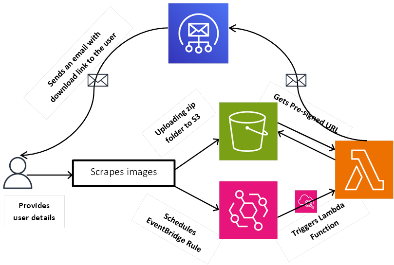

# Advanced Image Downloader/Scrapper
### The Advanced Image Downloader/Scraper is a Python-based project that allows you to download and scrape images from Google and store them in an Amazon S3 bucket. It leverages the power of Boto3, the AWS SDK for Python, to interact with the S3 service, SES, Lambda, and EventBridge services to perform the related operations.
## Features
#### - It scrapes images from Google based on user-defined category.
#### - Creates a zip folder containing the scraped images.
#### - Stores the zip folder in an S3 bucket.
#### - Generates pre-signed URL for the zip.
#### - Sends email notifications with download links to users.

## Architecture
### Overview of the architecture:

#### 1. User provides category name, schedule time, number of images to be downloaded, and email via a website.
#### 2. Images relevant to the category are scraped, zipped and stored in the AWS S3 bucket.
#### 3. The provided information is sent to an AWS Lambda function (say, myFunction) via EventBridge.
#### 4. myFunction is triggered based on the schedule time using CloudWatch Events.
#### 5. It retrieves the uploaded zip folder from the S3 bucket.
#### 6. Generates a pre-signed URL for the zip folder.
#### 7. Sends an email to the user with the download link using AWS SES.
#### 8. User receives the email with the download link and can access the scraped images.